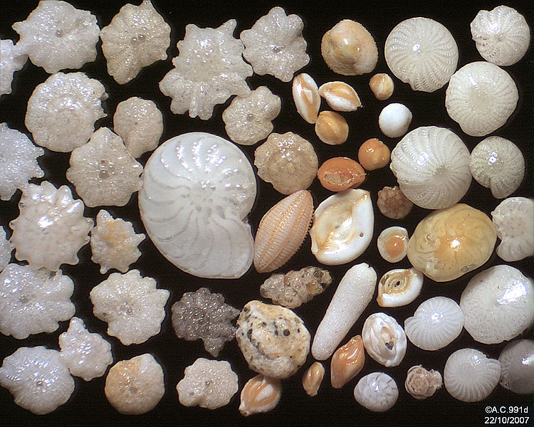

::: {.hero-grid}

::: {.hero-text}
#### Understanding Life at the Microscale  
Exploring how marine organisms respond to environmental change
:::

::: {.hero-image}
{alt="Foraminifera under microscope"}
:::

:::

::: {.content-card}
## About Me

Hi, I’m Ethan. I’m a student at William & Mary studying science, with a strong interest in biochemistry and how it connects to real-world problems.

I’m especially interested in how biological systems respond to real-world environmental change, particularly at the molecular level.

Outside of academics, I’m always looking for ways to learn, improve, and take on new challenges.
:::

::: {.content-card}
## Research: Foram Response to Environmental Stress

### Overview

This project explores how foraminifera—microscopic marine organisms critical to ocean ecosystems—respond to environmental stress such as changes in temperature and salinity.

### Methodology

- Field sampling across tidal cycles  
- Hourly sampling over ~3-hour windows  
- Glyoxal fixation (lab vs in situ)  
- Microscopy + morphospecies identification  
- RNA sequencing + PCR  

### Timeline

- Weeks 1–3: Sampling  
- Weeks 1–5: Fixation testing  
- Weeks 2–5: RNA prep  
- Weeks 6–7: Sequencing  

### Why It Matters

This work improves how scientists study organisms in real environments and strengthens foraminifera as indicators of ocean health.

:::

::: {.content-card}
## Lab Notebook

- **Week 1:** First sampling trip — testing collection timing  
- **Week 2:** Glyoxal pH trials  
- **Week 3:** Microscopy + species ID  
- **Week 4:** RNA extraction + PCR  

*(Updated regularly as the project progresses)*

:::

::: {.content-card}
## What I'm Learning

- Field sampling design  
- Microscopy + classification  
- RNA sequencing workflows  
- HPC data analysis  

:::

::: {.content-card}
## Contact

##### Ethan Doan

##### Email  
[etdoan (at) wm.edu](mailto:etdoan@wm.edu)

### Find me online
- [GitHub](https://github.com/etdoan)

:::